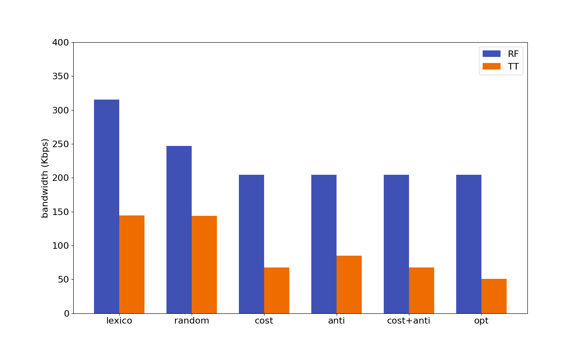
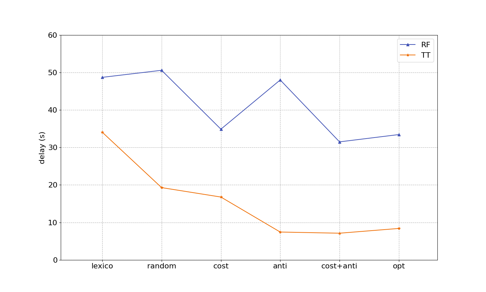
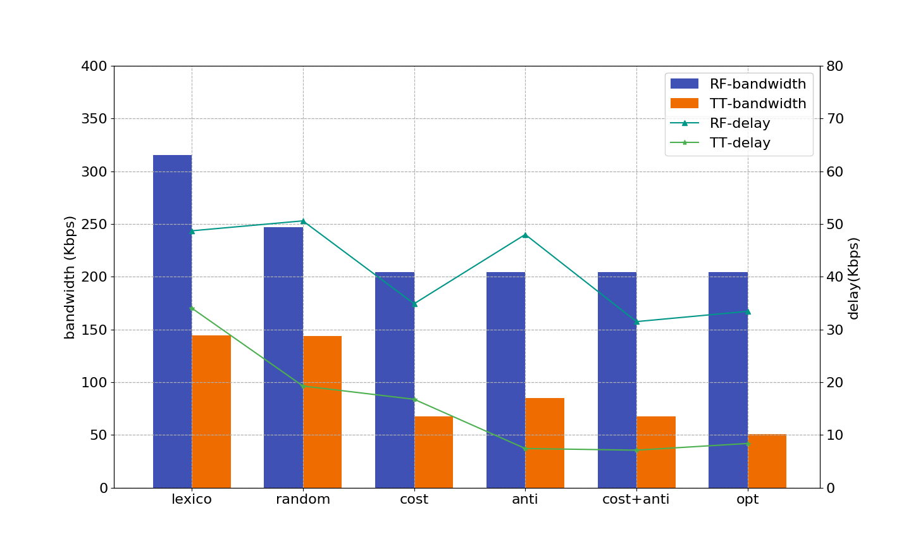

# Research Matplot Library

This repo contains a stupid matplot wrapper that I implemented during research.

### Current support
- Plot multiple histograms.
- Plot multiple line charts.
- Plot multiple histograms mixed with multiple line charts.

### Repo structure
- src: implementation of the lib.
- data: some experimental and demo data.
- example: some examples on how to use the lib.

### dat file format
Current implementation assumes following .dat structure:
```
# category g1_data g2_data g3_data g1_std_dev g2_std_dev g3_std_dev
Category1    100     200     300       1          3          5
Category2    200     300     600       3          2          6
Category3    420     650     700       1          4          9
```
 - g1_data ~ g3_data are the data that'll be plotted in the graph(both histograms and line charts). g1_std_dev ~ g3_std_dev are standard deviation associated with them, and they are only used when stdDev switch is turned on.

### Demo:




